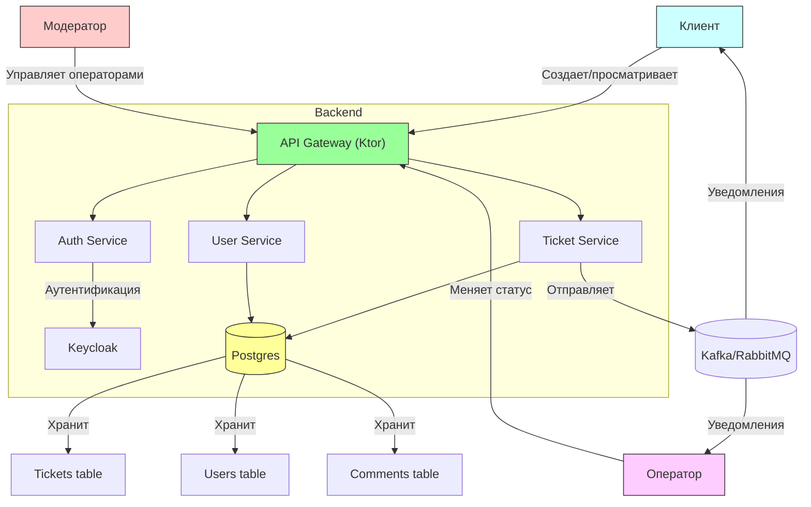

```mermaid
graph TD
%% Пользователи
C[Клиент] -->|Создает/просматривает| API
O[Оператор] -->|Меняет статус| API
M[Модератор] -->|Управляет операторами| API

    %% Основные компоненты
    subgraph Backend
        API["API Gateway (Ktor)"]
        API --> Auth[Auth Service]
        API --> Ticket[Ticket Service]
        API --> User[User Service]
        
        Auth -->|Аутентификация| Keycloak
        Ticket --> DB[(Postgres)]
        User --> DB
    end

    %% Взаимодействие
    Ticket -->|Отправляет| MQ[(Kafka/RabbitMQ)]
    MQ -->|Уведомления| C
    MQ -->|Уведомления| O

    %% Базы данных
    DB -->|Хранит| Tickets[Tickets table]
    DB -->|Хранит| Users[Users table]
    DB -->|Хранит| Comments[Comments table]

    %% Легенда
    style C fill:#cff,stroke:#333
    style O fill:#fcf,stroke:#333
    style M fill:#fcc,stroke:#333
    style API fill:#9f9,stroke:#333
    style DB fill:#ff9,stroke:#333

```